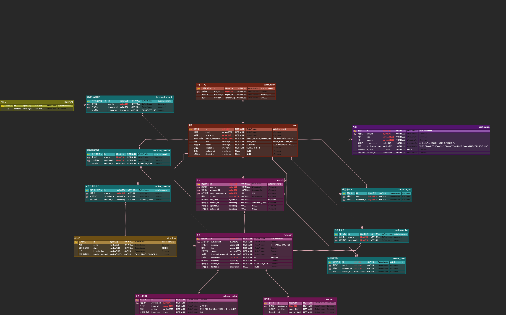

  

<h2 align="center">4컷 뉴스 요약 만화 NewSum</h2>

<h3 align="center">
<a href = "https://new-sum.com">뉴썸 서비스</a> 
| 
<a href = "https://github.com/100-hours-a-week/17-newsum-wiki/wiki">Wiki</a>
</h3>

## 📦 Dependency

- Java 17
- Spring Boot 3.2.12
- PosgreSQL 15

 

## 🛠️ Tech Stack

### Framework -   

### Database - 

### ORM -  

### API Docs - 

  

## 🖇️ DataBase Schema

  

  

## 🙋🏻‍♂️ Team

|                                                                                                                                              nick.kim                                                                                                                                              |                                                                                                                                           sua.song                                                                                                                                           |
|:--------------------------------------------------------------------------------------------------------------------------------------------------------------------------------------------------------------------------------------------------------------------------------------------------:|:--------------------------------------------------------------------------------------------------------------------------------------------------------------------------------------------------------------------------------------------------------------------------------------------:|
|   |   | 
